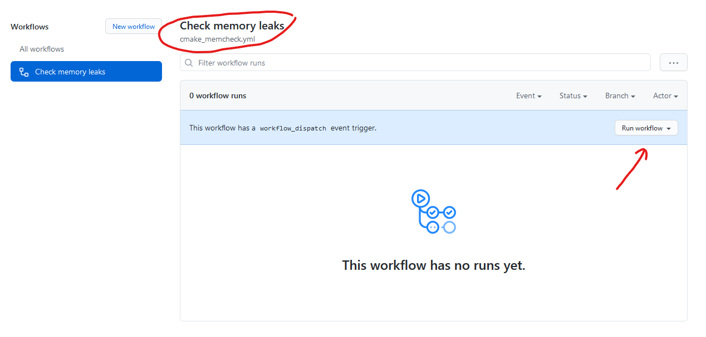

# Задание 2: Array List и Linked List

## Зиатдинов Марсель Петрович

*Пожалуйста, добавьте вместо курсивного текста своё ФИО*

## Описание задания

Реализуйте весь необходимый функционал связного списка (Linked List) и массива переменной длины (Array List).
Ориентируйтесь на прохождение всех юнит-тестов.

**Примечание**

Во вкладке "Actions" вы можете вручную запустить процесс проверки наличия **утечки памяти**.

## Цели

- Все тесты должны пройти успешно:
    - для этого разрешается вносить изменения только в файлы, указанные в инструкции ниже

- GitHub Actions должен показывать зеленый маркер, сообщая о том, что все тесты пройдены успешно:
    - красный маркер означает, что некоторые (или все) тесты провалились
    - **Совет 1:** можно кликнуть на красный маркер, чтобы узнать какой тест провалился (или почему программа не
      скомпилировалась)
    - **Совет 2:** если результаты тестов не обновляются, то следует сообщить об этом преподавателю

## Инструкции

1. Добавьте свое ФИО в файл `README.md` (файл, который Вы сейчас читаете).
2. Приведите решения к заданиям в файлах.

**Остальные файлы изменять нельзя!**

Структура проекта:

- [`src`](src) - папка с исходным кодом программы.
- [`include`](include) - папка с заголовочными файлами программы.
- [`tests`](tests) - Unit-тесты для проверки работоспособности кода.
- [`contrib`](contrib) - папка со сторонними библиотеками.
- [`CMakeLists.txt`](CMakeLists.txt) - главный файл системы автоматизации сборки проекта.

## Как запустить?

Импортируйте CMake проект в среду разработки (см. [инструкцию в Google Classroom](https://classroom.google.com/c/Mjc0ODY0MzE0OTE1/m/Mjg4NTc4Njg0Mjg1/details)).

## Заметки

- Решения будут оценены лишь в том случае, если программа компилируется:
    - если код не компилируется, то оценочные тесты не будут запущены

- Результирующие баллы высчитываются при каждом новом коммите (до установленного дедлайна)
- Дедлайн установлен в Google Classroom (за дополнительными вопросами обратитесь к преподавателю)
